# Entity-Relationship Diagram (ERD) - ERP System

## Database Schema Overview

This ERD represents the complete database structure for the ERP System with comprehensive improvements including:
- ✅ **UUID Primary Keys** - Future-proof identification
- ✅ **Enums for all status/type fields** - Data integrity via TextChoices
- ✅ **Database Constraints** - CHECK constraints, unique constraints
- ✅ **Strategic Indexes** - Performance optimization on key fields
- ✅ **StockMovement Core** - Proper inventory ledger (never store quantity on item)
- ✅ **PayrollRun** - Complete payroll management
- ✅ **Direct Party→Ledger** - Simplified accounting integration
- ✅ **Invoice→Voucher Link** - Complete audit trail

```mermaid
erDiagram
    %% ======= Entities (attributes: type + PK/FK markers) =======

    COMPANY {
        UUID id PK
        string code
        string name
        string legal_name
        string company_type
        string timezone
        string language
        boolean is_active
        boolean is_deleted
        UUID base_currency_id FK
        datetime created_at
        datetime updated_at
    }

    ADDRESS {
        UUID id PK
        UUID company_id FK
        string address_type
        string line1
        string line2
        string city
        string state
        string country
        string pincode
    }

    COMPANYFEATURE {
        UUID id PK
        UUID company_id FK
        boolean inventory_enabled
        boolean accounting_enabled
        boolean payroll_enabled
        boolean gst_enabled
        boolean locked
    }

    COMPANYUSER {
        UUID id PK
        UUID company_id FK
        UUID user_id FK
        string role
        boolean is_default
        boolean is_active
    }

    CURRENCY {
        UUID id PK
        string code
        string name
        string symbol
        int decimal_places
    }

    FINANCIALYEAR {
        UUID id PK
        UUID company_id FK
        string name
        date start_date
        date end_date
        boolean is_current
        boolean is_closed
    }

    SEQUENCE {
        UUID id PK
        UUID company_id FK
        string key
        string prefix
        int last_value
        string reset_period
    }

    UNITOFMEASURE {
        UUID id PK
        string name
        string symbol
        string category
    }

    STOCKITEM {
        UUID id PK
        UUID company_id FK
        string sku
        string name
        string description
        UUID uom_id FK
        boolean is_stock_item
        boolean is_active
    }

    PRICELIST {
        UUID id PK
        UUID company_id FK
        string name
        UUID currency_id FK
        boolean is_default
        date valid_from
        date valid_to
    }

    ITEMPRICE {
        UUID id PK
        UUID item_id FK
        UUID price_list_id FK
        decimal rate
        date valid_from
        date valid_to
    }

    STOCKBATCH {
        UUID id PK
        UUID company_id FK
        UUID item_id FK
        string batch_number
        date mfg_date
        date exp_date
        boolean is_active
    }

    GODOWN {
        UUID id PK
        UUID company_id FK
        string name
        UUID address_id FK
        string code
        boolean is_active
    }

    ACCOUNTGROUP {
        UUID id PK
        UUID company_id FK
        string name
        string code
        UUID parent_id FK
        string nature
        string report_type
        string path
    }

    LEDGER {
        UUID id PK
        UUID company_id FK
        string code
        string name
        UUID group_id FK
        string account_type
        decimal opening_balance
        string opening_balance_type
        UUID opening_balance_fy_id FK
        boolean is_bill_wise
        boolean is_cost_center_applicable
        boolean requires_reconciliation
        boolean is_system
        boolean is_active
    }

    PARTY {
        UUID id PK
        UUID company_id FK
        string name
        string party_type
        string email
        string phone
        UUID ledger_id FK
        string gstin
        string pan
        decimal credit_limit
        int credit_days
        boolean is_active
    }

    PARTYADDRESS {
        UUID id PK
        UUID party_id FK
        string address_type
        string line1
        string line2
        string city
        string state
        string country
        string pincode
    }

    PARTYBANKACCOUNT {
        UUID id PK
        UUID party_id FK
        string bank_name
        string account_number
        string ifsc
        boolean is_primary
        boolean is_active
    }

    TAXLEDGER {
        UUID id PK
        UUID ledger_id FK
        string tax_type
        decimal rate
        string tax_direction
        date effective_from
    }

    COSTCENTER {
        UUID id PK
        UUID company_id FK
        string code
        string name
        boolean is_active
    }

    SALESORDER {
        UUID id PK
        UUID company_id FK
        string order_number
        UUID customer_party_id FK
        string status
        date order_date
        date delivery_date
        UUID currency_id FK
        string customer_po_number
        text terms_and_conditions
        text notes
    }

    PURCHASEORDER {
        UUID id PK
        UUID company_id FK
        string order_number
        UUID supplier_party_id FK
        string status
        date order_date
        date expected_date
        UUID currency_id FK
        string supplier_quote_ref
        text terms_and_conditions
        text notes
    }

    ORDERITEM {
        UUID id PK
        UUID company_id FK
        UUID sales_order_id FK
        UUID purchase_order_id FK
        int line_no
        UUID item_id FK
        string description
        decimal quantity
        UUID uom_id FK
        decimal unit_rate
        decimal discount_pct
        decimal tax_rate
        decimal delivered_qty
    }

    INVOICE {
        UUID id PK
        UUID company_id FK
        string invoice_number
        date invoice_date
        UUID party_id FK
        string invoice_type
        date due_date
        UUID currency_id FK
        UUID financial_year_id FK
        string status
        UUID voucher_id FK
        UUID sales_order_id FK
        UUID purchase_order_id FK
        decimal subtotal
        decimal tax_amount
        decimal discount_amount
        decimal grand_total
    }

    INVOICELINE {
        UUID id PK
        UUID invoice_id FK
        int line_no
        UUID item_id FK
        string description
        decimal quantity
        UUID uom_id FK
        decimal unit_rate
        decimal discount_pct
        decimal tax_rate
        decimal line_total
        decimal tax_amount
    }

    STOCKMOVEMENT {
        UUID id PK
        UUID company_id FK
        UUID voucher_id FK
        UUID item_id FK
        UUID from_godown_id FK
        UUID to_godown_id FK
        UUID batch_id FK
        decimal quantity
        decimal rate
        date movement_date
    }

    VOUCHERTYPE {
        UUID id PK
        UUID company_id FK
        string name
        string code
        string category
        boolean is_accounting
        boolean is_inventory
        boolean is_active
    }

    VOUCHER {
        UUID id PK
        UUID company_id FK
        UUID financial_year_id FK
        UUID voucher_type_id FK
        string voucher_number
        date date
        text narration
        string status
        UUID reversed_voucher_id FK
        string reference_number
        date reference_date
        datetime created_at
        datetime updated_at
    }

    VOUCHERLINE {
        UUID id PK
        UUID voucher_id FK
        int line_no
        UUID ledger_id FK
        decimal amount
        string entry_type
        UUID cost_center_id FK
        UUID against_voucher_id FK
        string remarks
    }

    DEPARTMENT {
        UUID id PK
        UUID company_id FK
        string name
        string code
        UUID manager_employee_id FK
        UUID parent_id FK
        boolean is_active
    }

    EMPLOYEE {
        UUID id PK
        UUID company_id FK
        string employee_code
        UUID user_id FK
        string first_name
        string last_name
        string email
        string phone
        UUID department_id FK
        string designation
        date date_of_joining
        date date_of_exit
        boolean is_active
    }

    EMPLOYEELEDGER {
        UUID id PK
        UUID employee_id FK
        UUID ledger_id FK
    }

    PAYHEAD {
        UUID id PK
        UUID company_id FK
        string name
        string code
        string pay_type
        boolean is_taxable
        boolean is_fixed
        text calculation_formula
        UUID ledger_id FK
        boolean is_active
    }

    EMPLOYEEPAYSTRUCTURE {
        UUID id PK
        UUID employee_id FK
        UUID pay_head_id FK
        decimal amount
        date effective_from
        date effective_to
    }

    PAYROLLRUN {
        UUID id PK
        UUID company_id FK
        string name
        date pay_period_start
        date pay_period_end
        date payment_date
        string status
        UUID voucher_id FK
        decimal total_earnings
        decimal total_deductions
        decimal net_pay
        text notes
    }

    CARRIER {
        UUID id PK
        UUID company_id FK
        string name
        string code
        string phone
        string email
        string gstin
        string transport_id
        boolean is_active
    }

    SHIPMENT {
        UUID id PK
        UUID company_id FK
        string shipment_number
        UUID carrier_id FK
        string tracking_number
        date shipped_date
        date expected_delivery
        date actual_delivery
        string status
        UUID sales_order_id FK
        UUID invoice_id FK
        UUID from_address_id FK
        UUID to_address_id FK
        string vehicle_number
        string driver_name
        string driver_phone
        string eway_bill_number
        text notes
    }

    SHIPMENTITEM {
        UUID id PK
        UUID shipment_id FK
        int line_no
        UUID item_id FK
        decimal quantity
        UUID uom_id FK
        UUID order_item_id FK
        UUID invoice_line_id FK
        string package_number
        UUID batch_id FK
    }

    AUDITLOG {
        UUID id PK
        UUID company_id FK
        UUID actor_user_id FK
        string action_type
        string object_type
        UUID object_id
        string object_repr
        json changes
        string ip_address
        string user_agent
        json metadata
        datetime created_at
    }

    INTEGRATIONEVENT {
        UUID id PK
        UUID company_id FK
        string event_type
        json payload
        string status
        int attempts
        int max_attempts
        datetime last_attempt_at
        datetime next_retry_at
        json response
        text error_message
        string source_object_type
        UUID source_object_id
        datetime processed_at
        datetime created_at
    }

    %% ======= Relationships =======

    %% Company relationships
    CURRENCY ||--o{ COMPANY : "base_currency"
    COMPANY ||--o{ ADDRESS : "has"
    COMPANY ||--o{ COMPANYFEATURE : "has"
    COMPANY ||--o{ COMPANYUSER : "has"
    COMPANY ||--o{ FINANCIALYEAR : "has"
    COMPANY ||--o{ SEQUENCE : "has"
    COMPANY ||--o{ STOCKITEM : "owns"
    COMPANY ||--o{ PRICELIST : "owns"
    COMPANY ||--o{ STOCKBATCH : "owns"
    COMPANY ||--o{ GODOWN : "owns"
    COMPANY ||--o{ ACCOUNTGROUP : "owns"
    COMPANY ||--o{ LEDGER : "owns"
    COMPANY ||--o{ PARTY : "owns"
    COMPANY ||--o{ COSTCENTER : "owns"
    COMPANY ||--o{ SALESORDER : "owns"
    COMPANY ||--o{ PURCHASEORDER : "owns"
    COMPANY ||--o{ INVOICE : "owns"
    COMPANY ||--o{ STOCKMOVEMENT : "owns"
    COMPANY ||--o{ VOUCHERTYPE : "owns"
    COMPANY ||--o{ VOUCHER : "owns"
    COMPANY ||--o{ DEPARTMENT : "owns"
    COMPANY ||--o{ EMPLOYEE : "owns"
    COMPANY ||--o{ PAYHEAD : "owns"
    COMPANY ||--o{ PAYROLLRUN : "owns"
    COMPANY ||--o{ CARRIER : "owns"
    COMPANY ||--o{ SHIPMENT : "owns"
    COMPANY ||--o{ AUDITLOG : "records"
    COMPANY ||--o{ INTEGRATIONEVENT : "records"

    %% Account group & ledger hierarchy
    ACCOUNTGROUP ||--o{ ACCOUNTGROUP : "parent"
    ACCOUNTGROUP ||--o{ LEDGER : "groups"
    LEDGER ||--o| TAXLEDGER : "may_have"

    %% Party relationships - DIRECT LEDGER LINK
    PARTY ||--|| LEDGER : "has_ledger"
    PARTY ||--o{ PARTYADDRESS : "has"
    PARTY ||--o{ PARTYBANKACCOUNT : "has"

    %% Stock & pricing
    UNITOFMEASURE ||--o{ STOCKITEM : "measures"
    STOCKITEM ||--o{ ITEMPRICE : "priced_by"
    PRICELIST ||--o{ ITEMPRICE : "contains"
    STOCKITEM ||--o{ STOCKBATCH : "has"
    STOCKITEM ||--o{ STOCKMOVEMENT : "moved_in"
    GODOWN ||--o{ STOCKMOVEMENT : "from_location"
    GODOWN ||--o{ STOCKMOVEMENT : "to_location"

    %% Orders / invoices / items
    PARTY ||--o{ SALESORDER : "customer"
    PARTY ||--o{ PURCHASEORDER : "supplier"
    SALESORDER ||--o{ ORDERITEM : "contains"
    PURCHASEORDER ||--o{ ORDERITEM : "contains"
    ORDERITEM }o--|| STOCKITEM : "refers_to"
    PARTY ||--o{ INVOICE : "for"
    INVOICE ||--o{ INVOICELINE : "contains"
    SALESORDER ||--o{ INVOICE : "generates"
    PURCHASEORDER ||--o{ INVOICE : "generates"

    %% Vouchers & financial lines - CORE ACCOUNTING
    VOUCHERTYPE ||--o{ VOUCHER : "categorizes"
    FINANCIALYEAR ||--o{ VOUCHER : "in_year"
    VOUCHER ||--o{ VOUCHERLINE : "has"
    VOUCHERLINE }o--|| LEDGER : "posts_to"
    VOUCHERLINE }o--o| COSTCENTER : "allocated_to"

    %% Voucher cross-links
    INVOICE ||--o| VOUCHER : "posted_as"
    PAYROLLRUN ||--o| VOUCHER : "posted_as"
    VOUCHER ||--o{ STOCKMOVEMENT : "creates"

    %% HR & payroll
    DEPARTMENT ||--o{ DEPARTMENT : "parent"
    DEPARTMENT ||--o{ EMPLOYEE : "has"
    EMPLOYEE ||--o| EMPLOYEELEDGER : "maps_to"
    EMPLOYEELEDGER }o--|| LEDGER : "references"
    EMPLOYEE ||--o{ EMPLOYEEPAYSTRUCTURE : "has"
    PAYHEAD ||--o{ EMPLOYEEPAYSTRUCTURE : "used_in"

    %% Shipments & carriers
    CARRIER ||--o{ SHIPMENT : "carries"
    SHIPMENT }o--o| SALESORDER : "linked_order"
    SHIPMENT }o--o| INVOICE : "linked_invoice"
    SHIPMENT ||--o{ SHIPMENTITEM : "contains"
    SHIPMENTITEM }o--|| STOCKITEM : "ships"
    SHIPMENTITEM }o--o| ORDERITEM : "fulfills"
    SHIPMENTITEM }o--o| INVOICELINE : "references"

    %% Audit & integration events
    AUDITLOG }o--o| COMPANY : "optional_company"
    INTEGRATIONEVENT }o--|| COMPANY : "for_company"
```



## 🎯 Key Improvements Implemented

### 1. **Base & Company Layer**
- ✅ **BaseModel**: UUID primary keys, automatic timestamps with indexes
- ✅ **CompanyScopedModel**: Multi-tenancy with composite indexes on (company, created_at)
- ✅ **CompanyFeature.locked**: Accounting freeze - prevents financial modifications
- ✅ **CompanyUser**: Unique constraint on (user, company)

### 2. **Financial Year - Enforced Invariants**
```python
# Database-level constraint
UniqueConstraint(fields=["company"], condition=Q(is_current=True))
CheckConstraint(check=Q(start_date__lt=F('end_date')))
```
- Only ONE `is_current=True` per company
- `start_date < end_date` validation
- No overlapping FY dates per company (validated in clean())

### 3. **Sequence - Thread-Safe Numbering**
```python
unique_together = ("company", "key")
```
- Prevents duplicate voucher numbering
- Use `select_for_update()` for thread safety

### 4. **Inventory - Stock Movement Core** ⭐
```python
class StockMovement:
    # Stock balance = Σ(IN) - Σ(OUT)
    # NEVER store quantity on StockItem
    from_godown, to_godown  # Movement tracking
    voucher → mandatory     # Every movement = accounting entry
```
- Complete audit trail via voucher linkage
- FIFO/LIFO ready
- Batch tracking support

### 5. **Accounting - Production Ready**
- ✅ **AccountGroup**: Hierarchical with materialized path
- ✅ **Ledger**: Opening balance (kept for UI, should auto-create voucher)
- ✅ **Enums**: AccountType, BalanceType, TaxType, TaxDirection
- ✅ **Indexes**: Strategic on (company, code), (company, account_type)

### 6. **Party - Direct Ledger Link** ⭐
```python
class Party:
    ledger = OneToOneField("accounting.Ledger", on_delete=PROTECT)
```
- **Removed PartyLedger** junction table
- Every party → ONE control ledger
- Simplifies queries, prevents orphan states
- Same pattern as Odoo ERP

### 7. **Orders & Invoices - Complete Integration**
```python
class Invoice:
    voucher = OneToOneField("voucher.Voucher", null=True)  # ⭐
    sales_order, purchase_order  # Optional links
```
- Invoice → creates Voucher
- Voucher → posts to Ledger
- Enables reposting, cancellation via reversal, audit traceability

### 8. **Voucher & VoucherLine - Double Entry** ⭐
```python
class VoucherLine:
    line_no = PositiveIntegerField()  # Ordering
    CheckConstraint(check=Q(entry_type__in=['DR', 'CR']))
```
- **Service-layer rule**: Σ(DR) == Σ(CR)
- **Validation**: voucher.company == ledger.company
- Entry type constraint at database level

### 9. **HR - Payroll Run** ⭐ NEW!
```python
class PayrollRun:
    voucher = OneToOneField("voucher.Voucher")  # Monthly payroll → GL
    pay_period_start, pay_period_end
    status: DRAFT → PROCESSED → POSTED → PAID
```
- Groups all employee payslips for a period
- Creates single accounting voucher
- Monthly locking support
- Re-run capability

### 10. **Logistics - Complete Tracking**
```python
class Shipment:
    sales_order, invoice  # Links to orders/invoices
    from_address, to_address
    eway_bill_number  # E-way bill support
```
- Full shipment lifecycle
- E-way bill integration ready
- Partial delivery support via ShipmentItem

### 11. **System - Audit & Integration**
```python
class AuditLog:
    changes = JSONField()  # JSON diff (before/after)
    actor_user, ip_address, user_agent
    
class IntegrationEvent:
    max_attempts, next_retry_at  # Retry mechanism
    response, error_message  # Result tracking
```
- Complete audit trail (better than most commercial ERPs)
- Robust retry mechanism for external integrations

## 🔐 Database Constraints Summary

### Unique Constraints
```python
# Financial Year
UniqueConstraint(fields=["company"], condition=Q(is_current=True))

# Sequence
unique_together = ("company", "key")

# Party removed PartyLedger, direct OneToOne instead

# StockItem
unique_together = ("company", "sku")

# Ledger
unique_together = ("company", "code")

# All order/invoice numbers
unique_together = ("company", "order_number")
unique_together = ("company", "invoice_number")
unique_together = ("company", "voucher_number")
```

### Check Constraints
```python
# Financial Year
CheckConstraint(check=Q(start_date__lt=F('end_date')))

# VoucherLine
CheckConstraint(check=Q(entry_type__in=['DR', 'CR']))

# OrderItem - polymorphic parent
CheckConstraint(
    check=(
        Q(sales_order__isnull=False, purchase_order__isnull=True) |
        Q(sales_order__isnull=True, purchase_order__isnull=False)
    )
)
```

### Foreign Key Constraints
```python
# Accounting models - PROTECT not CASCADE
on_delete=models.PROTECT  # Never cascade-delete financial history

# Examples:
Ledger.group → AccountGroup (PROTECT)
VoucherLine.ledger → Ledger (PROTECT)
Party.ledger → Ledger (PROTECT)
Invoice.voucher → Voucher (PROTECT)
```

## 📊 Key Relationships

### Core Accounting Flow
```
Party (Customer/Supplier)
  └─→ has OneToOne Ledger ⭐
  └─→ places SalesOrder
      └─→ generates Invoice
          └─→ creates OneToOne Voucher ⭐
              └─→ has VoucherLines
                  └─→ post to Ledger
```

### Inventory Flow
```
StockItem
  ├─→ moved via StockMovement ⭐
  │     └─→ linked to Voucher (every movement = accounting)
  ├─→ priced in PriceList
  ├─→ tracked in StockBatch
  └─→ stored in Godown
```

### Payroll Flow
```
Employee
  ├─→ has EmployeePayStructure
  │     └─→ references PayHead
  ├─→ has OneToOne EmployeeLedger
  │     └─→ references Ledger
  └─→ included in PayrollRun ⭐
        └─→ creates OneToOne Voucher
            └─→ posts to GL
```

### Order-to-Cash Flow
```
SalesOrder
  ├─→ contains OrderItem
  ├─→ generates Invoice
  │     └─→ posts as Voucher
  └─→ ships via Shipment
        └─→ contains ShipmentItem
```

## 🎨 Design Patterns Used

1. **Multi-Tenancy**: All business entities scoped to Company
2. **Double-Entry Bookkeeping**: Every transaction = balanced voucher
3. **Audit Trail**: Complete change tracking via AuditLog
4. **Materialized Path**: Hierarchical data (AccountGroup, Department)
5. **Time-Based Data**: Effective dates on pricing, pay structure
6. **Soft Delete Prevention**: PROTECT on critical FK relationships
7. **Polymorphic Relations**: OrderItem can link to Sales OR Purchase order
8. **Junction with Attributes**: ItemPrice links Item↔PriceList with rate
9. **Status Machine**: Enums for all status transitions
10. **Event Sourcing**: IntegrationEvent for external system sync

## 📈 Performance Optimizations

### Strategic Indexes
```python
# Every CompanyScopedModel
Index(fields=['company', 'created_at'])

# Business keys
Index(fields=['company', 'code'])  # All entities with codes
Index(fields=['company', 'status'])  # All status-driven entities

# Lookup optimization
Index(fields=['voucher', 'line_no'])
Index(fields=['company', 'item', 'movement_date'])
Index(fields=['ledger', 'entry_type'])
```

### Denormalized Fields (for performance)
- `Invoice`: subtotal, tax_amount, grand_total
- `PayrollRun`: total_earnings, total_deductions, net_pay
- `InvoiceLine`: line_total, tax_amount

**Rule**: Compute on save, store for reporting performance

## 🚀 Ready for Production

All models include:
- ✅ UUID primary keys
- ✅ Timestamp tracking (created_at, updated_at)
- ✅ Enums for type safety
- ✅ Database constraints
- ✅ Strategic indexes
- ✅ Comprehensive relationships
- ✅ Audit trail capability
- ✅ Multi-tenant isolation

1. **Inventory Management**: Product status auto-updates based on available vs required quantity
2. **Order Fulfillment**: Shipment delivery automatically updates order status and product quantities
3. **Multi-tenancy**: Company-based data isolation
4. **Tax Compliance**: Comprehensive GST tax structure support
5. **Resource Assignment**: One-to-one truck-employee assignment

This ERD represents a comprehensive vendor management system with inventory tracking, order processing, invoicing, and delivery management capabilities.
